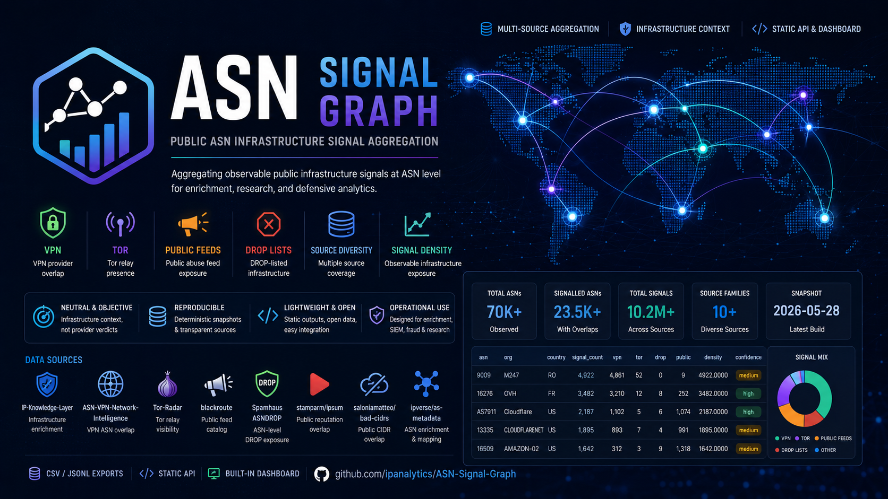

_English version: [README.md](README.md)_

# ASN Signal Graph

<p align="center">
  
</p>

<p align="center">
  <a href="LICENSE">
    
  </a>
  <a href="https://github.com/ipanalytics/ASN-Signal-Graph/actions">
    
  </a>
  <a href="https://github.com/ipanalytics/ASN-Signal-Graph">
    
  </a>
  <a href="https://github.com/ipanalytics/ASN-Signal-Graph">
    
  </a>
  <a href="https://github.com/ipanalytics/ASN-Signal-Graph">
    
  </a>
  <a href="https://github.com/ipanalytics/ASN-Signal-Graph">
    
  </a>
</p>

---

ASN Signal Graph — публичный проект агрегации инфраструктурных сигналов на уровне ASN для обогащения данных, исследований и оборонительной аналитики.

Репозиторий агрегирует наблюдаемые публичные инфраструктурные сигналы на уровне ASN и публикует нормализованные профили, описывающие пересечение с VPN, присутствие Tor, доступность в публичных фидах, пересечение с инфраструктурой из DROP-списков и разнообразие источников.

Проект намеренно представляет результаты как инфраструктурный контекст, а не как репутацию провайдеров или классификацию вредоносности.

---

## Обзор

Современная хостинг- и сетевая инфраструктура часто пересекается в следующих категориях:

* VPN-провайдеры
* релеи Tor
* публичные фиды о злоупотреблениях
* инфраструктура краулеров
* облачные и VPS-платформы
* публичные блок-листы

ASN Signal Graph агрегирует эти наблюдаемые сигналы в лёгкие операционные профили, подходящие для:

* выявления мошенничества
* обогащения данных SIEM
* исследований инфраструктуры
* анализа маршрутизации
* процессов предотвращения злоупотреблений
* конвейеров сетевой разведки

Репозиторий не классифицирует провайдеров как вредоносные и не присваивает вердиктов принудительного характера.

---

## Модель сигналов

Основной объект — профиль ASN:

```text id="jlwm42"
ASN / organization / country
    -> vpn overlap
    -> tor overlap
    -> drop-list overlap
    -> public feed overlap
    -> signal density
    -> source diversity
    -> confidence
```

Пример вывода:

```csv id="jlwm43"
asn,org,country,total_prefixes,signal_count,source_count,vpn_signals,tor_signals,abuse_feed_overlap,drop_list_overlap,public_feed_overlap,signal_density,confidence,sources
9009,M247,RO,0,4922,3,4861,52,0,0,9,4922.0000,medium,"asn-vpn-multi-provider,bad-cidrs-v4,tor-radar-network"
```

Счётчики сигналов отражают пересечение с публичными наборами данных и наблюдениями инфраструктуры. Они предназначены как признаки для обогащения (enrichment features), а не как вердикты о провайдерах.

---

## Архитектура

```text id="jlwm44"
              Public Infrastructure Sources
                              │
      ┌───────────────────────┼────────────────────────┐
      │                       │                        │
      ▼                       ▼                        ▼
   VPN Signals            Tor Signals           Public Feeds
      │                       │                        │
      └───────────────────────┴─────────────┬──────────┘
                                            ▼
                                  ASN Aggregation Layer
                               normalize / correlate / score
                                            ▼
                                     Signal Profiles
                                            ▼
                           CSV / JSONL / static API / dashboard
```

---

## Источники данных

Настроенные источники определены в:

```text id="jlwm45"
config/sources.json
```

Текущие входные данные включают:

| Источник                       | Назначение                       |
| ------------------------------ | -------------------------- |
| `IP-Knowledge-Layer`           | Обогащение инфраструктурных данных  |
| `ASN-VPN-Network-Intelligence` | Пересечение VPN ASN            |
| `Tor-Radar`                    | Видимость релеев Tor       |
| `blackroute`                   | Каталог публичных фидов        |
| Spamhaus ASNDROP               | Доступность DROP на уровне ASN    |
| `stamparm/ipsum`               | Пересечение с публичными данными репутации  |
| `saloniamatteo/bad-cidrs`      | Пересечение с публичными CIDR        |
| `ipverse/as-metadata`          | Обогащение и сопоставление ASN |

Фиды на уровне ASN агрегируются напрямую.

Фиды CIDR с метками провайдеров сопоставляются через нормализованные метаданные провайдеров. Фиды, содержащие только IP, индексируются отдельно, пока недоступно надёжное сопоставление IP/CIDR с ASN.

---

## Публикуемые выходные данные

| Файл                                      | Описание                                  |
| ----------------------------------------- | ----------------------------------------- |
| `data/current/asn-signals.csv`            | Плоский экспорт ASN-сигналов              |
| `data/current/hosting-signal-graph.jsonl` | Полные профили сигналов в формате JSONL   |
| `data/current/provider-overlap.csv`       | Агрегированные данные о пересечениях провайдеров |
| `data/current/source-index.json`          | Метаданные источников и индексация        |
| `data/current/summary.json`               | Сводка снимка                             |
| `data/current/dashboard-data.json`        | Набор данных дашборда                     |
| `data/api/index.json`                     | Статический индекс API                    |
| `data/api/asn/<asn>.json`                 | API подробных данных об ASN               |
| `data/api/top/<signal>.json`              | Рейтинги ведущих ASN по сигналам          |
| `data/api/country/<country>.json`         | Представления на уровне стран             |

API полностью статический и может размещаться непосредственно на GitHub Pages.

---

## Дашборд

В репозитории находится статический дашборд для браузера в каталоге:

```text id="jlwm46"
site/
```

Возможности:

* поиск ASN по номеру или организации
* фильтрация по стране и сигналу
* сортируемые таблицы сигналов
* минимальные пороги сигналов
* фильтрация по достоверности
* кликабельные сводные метрики
* панели с подробными данными по ASN
* прямые ссылки на экспорт JSON

Дашборд полностью обходится без бэкенда.

---

## Семантика сигналов

Уровни сигналов описывают наблюдаемый объём пересечений инфраструктуры, а не репутацию провайдера.

| Уровень  | Значение                              |
| -------- | ------------------------------------- |
| `none`   | Нет наблюдаемого пересечения          |
| `low`    | Небольшое наблюдаемое пересечение     |
| `medium` | Умеренное пересечение                 |
| `high`   | Большое наблюдаемое пересечение       |

### Достоверность (confidence)

Достоверность отражает полноту данных и разнообразие источников.

| Достоверность | Требования                             |
| ------------- | -------------------------------------- |
| `high`        | ≥5 семейств источников и ≥25 сигналов  |
| `medium`      | ≥3 семейства источников и ≥5 сигналов  |
| `low`         | Ниже порога medium                     |

Достоверность не является оценкой «плохости».

---

## Быстрый старт

Загрузите внешние (upstream) наборы данных:

```bash id="jlwm47"
python3 scripts/fetch_sources.py \
  --sources config/sources.json
```

Соберите текущие выходные данные:

```bash id="jlwm48"
python3 scripts/build_signal_graph.py \
  --sources config/sources.json \
  --output-dir data/current
```

Запустите локальный сервер:

```bash id="jlwm49"
python3 -m http.server 8000
```

Откройте:

```text id="jlwm50"
http://127.0.0.1:8000/site/
```

---

## GitHub Actions

| Workflow                 | Назначение                                                        |
| ------------------------ | ----------------------------------------------------------------- |
| `Test`                   | Валидация снимков, выходных данных CSV/JSON и сборок дашборда     |
| `Build ASN Signal Graph` | Обновление внешних данных и агрегация по расписанию или вручную   |
| `Deploy Pages`           | Публикация статического дашборда и API                            |

Проект рассчитан на статическое развёртывание с использованием нативных средств GitHub.

---

## Примечания по эксплуатации

* Крупные облачные и VPS-провайдеры часто встречаются в публичных фидах пересечений из-за масштаба и разнообразия клиентов
* Пересечения из публичных фидов следует интерпретировать с учётом разнообразия источников и состава сигналов
* Фиды, содержащие только IP, требуют надёжного сопоставления ASN, прежде чем учитывать взвешенные счётчики ASN
* Плотность сигналов отражает наблюдаемую экспозицию инфраструктуры, а не намерения или принадлежность

---

## Принципы проектирования

| Принцип                | Описание                                              |
| ---------------------- | ----------------------------------------------------- |
| Neutral Framing        | Контекст инфраструктуры вместо вердиктов о провайдерах |
| Reproducibility        | Детерминированная генерация снимков                    |
| Lightweight Deployment | Полностью статические выходные данные и API            |
| Source Transparency    | Сохранение происхождения и разнообразия источников     |
| Operational Utility    | Полезность для процессов обогащения и аналитики        |

---

## Рекомендуемая интерпретация

Предпочтительная терминология:

* наблюдаемые сигналы
* пересечение инфраструктуры
* разнообразие источников
* экспозиция в публичных фидах
* контекст инфраструктуры
* достоверность

Избегайте:

* «вредоносный ASN»
* «плохой провайдер»
* «криминальный хостинг»
* «окончательная атрибуция»
* «вердикты для принудительных мер»

Проект публикует наблюдаемые корреляции инфраструктуры, полученные из публичных наборов данных.

---

## Сценарии использования

| Домен                 | Пример                                  |
| --------------------- | --------------------------------------- |
| Fraud Detection       | Обогащение данными о VPN и Tor          |
| SIEM Pipelines        | Инфраструктурный контекст ASN           |
| Network Analytics     | Анализ концентрации хостинга            |
| Abuse Prevention      | Анализ пересечений в публичных фидах    |
| Research              | Построение карты связей инфраструктуры  |
| Routing Analysis      | Кластеризация ASN-сигналов              |

---

## Структура репозитория

```text id="jlwm51"
.
├── config/
├── data/
│   ├── api/
│   └── current/
├── scripts/
├── site/
├── LICENSE
└── README.md
```

---

## Дорожная карта

Планируемые дополнения:

* отслеживание изменений ASN
* кластеризация семейств сигналов
* поддержка перекрытий IPv6
* построение графа отношений ASN
* компактные исторические сводки
* метрики топологии инфраструктуры

---

## Лицензия

Код в этом репозитории распространяется по лицензии Apache-2.0.

Опубликованные наборы данных и сгенерированные артефакты данных выпускаются под лицензией CC0-1.0.

См.:

- [`LICENSE`](./LICENSE)
- [`DATA-LICENSE`](./DATA-LICENSE)

---

## Отказ от ответственности

ASN Signal Graph агрегирует публично наблюдаемые сигналы инфраструктуры для аналитических и операционных задач. Проект не классифицирует провайдеров как вредоносные и не должен использоваться как самостоятельная система правоприменения или атрибуции.
